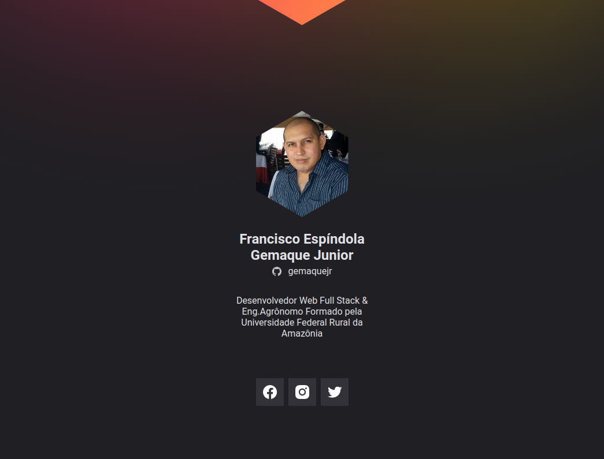

# Projeto desenvolvido na missão Origin do NLW Heat.

Layout de apresentação de suas redes sociais e o seu Github.

É uma aplicação simples que visa ensinar os fundamentos da programação para quem está no início da jornada. :heavy_check_mark:

## 🚀 Tecnologias

- ⚡ HTML é a linguagem base para se desenvolver qualquer site.

- ⚡ CSS é uma linguagem de folha de estilo composta por “camadas”, criado com o propósito de estilizar as páginas HTML.

## ✋🏻 Pré-requisitos

- [git](https://git-scm.com/downloads): Ferramenta para gerenciar o código-fonte

- [Visual Studio Code](https://code.visualstudio.com/): Editor de Código Fonte
- [Live Server](https://marketplace.visualstudio.com/items?itemName=ritwickdey.LiveServer): Extensão do Visual Studio Code que permite criar um servidor HTTP para servir páginas HTML

## :hammer_and_wrench: Visualização do Projeto.

No diretório do projeto, em seu Visual Studio Code, aperte F1 e na caixa de pesquisa, digite: `Live Server: Open With Live Server` para iniciar um servidor.
